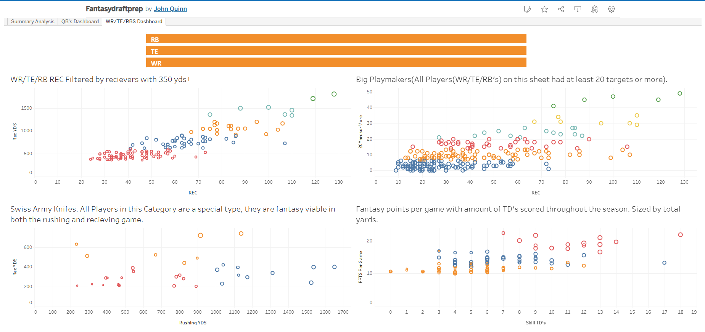

# Fantasy_Football_stats
# Major WIP

Derivative of my FantasyFootballDB Repo. https://github.com/Quinn-johndavid/FantasyFootballDB is where the data is cleaned and held, and this repo will be dedicated to reporting what findings I discover Will primarily use tableau until I discover another need for another tool. Mainly made this repo to help me out in future fantasy drafts, going to be fleshed out more as I am able to further finetune the stats. Will be updated and expanded upon. Tableau workbook is hosted here: 
https://public.tableau.com/app/profile/john.quinn3620/viz/Fantasydraftprep/SummaryAnalysis. 

